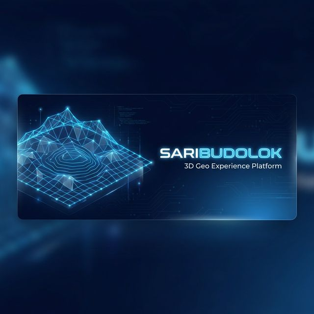
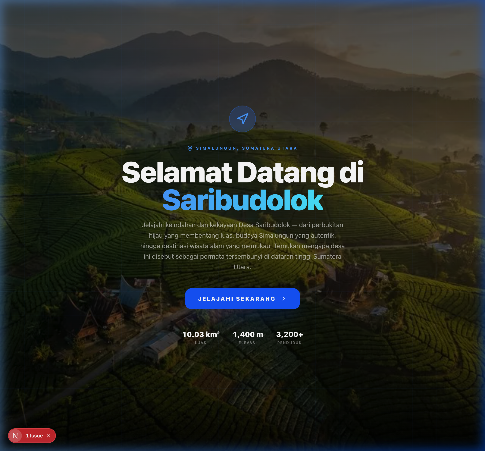
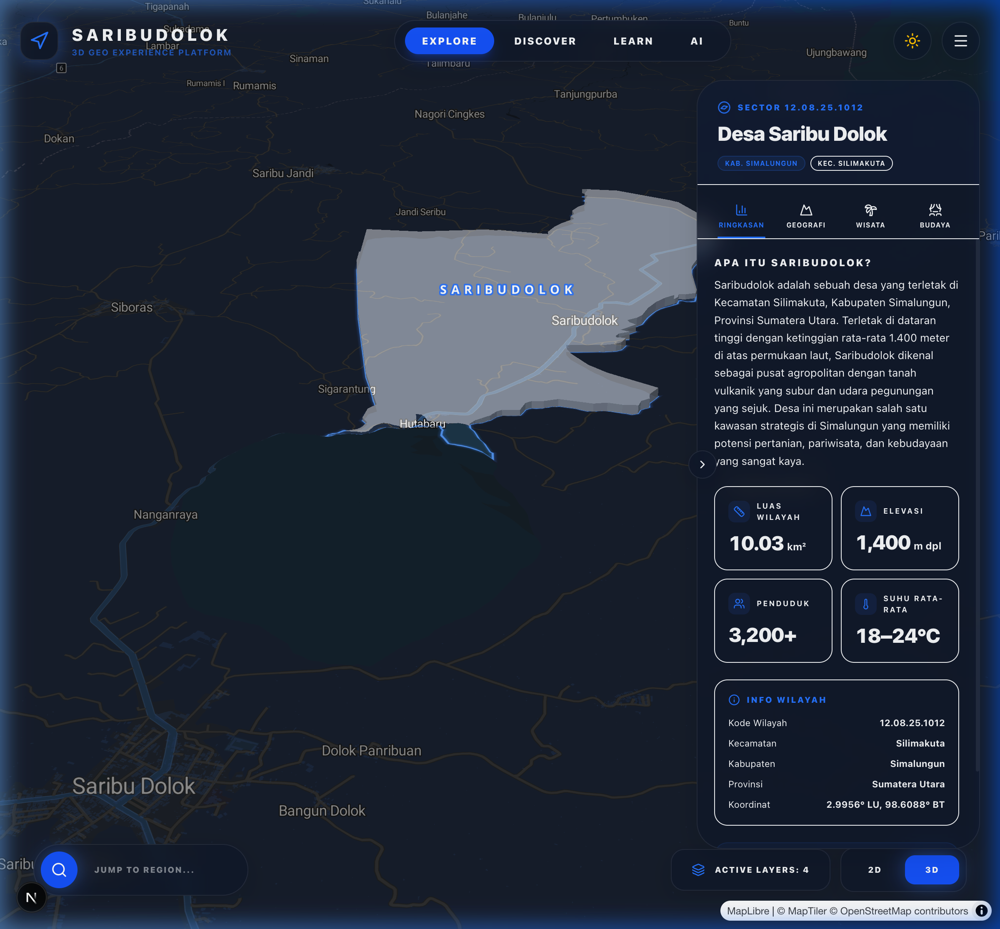
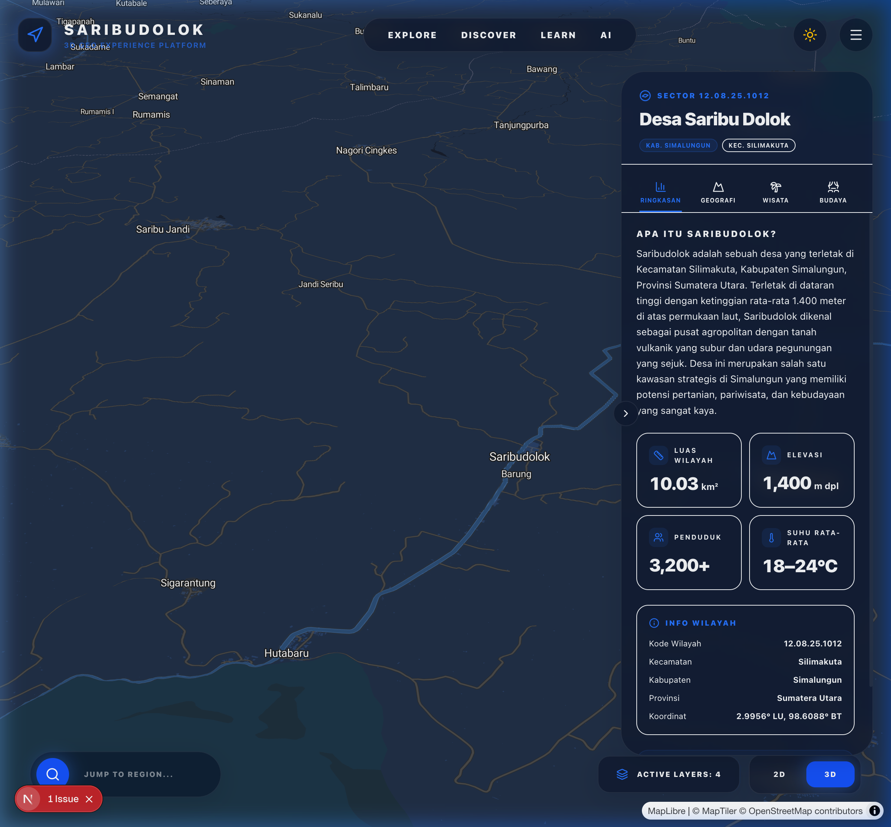
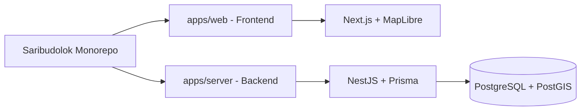

<div align="center">

# 🏔️ Saribudolok: 3D Geo Experience Platform
**Elevating Geographic Exploration with Immersive 3D Spatial Intelligence**

[](https://nextjs.org/)
[](https://www.typescriptlang.org/)
[](https://www.postgresql.org/)
[](https://tailwindcss.com/)



---

### **"Bringing the Beauty of Saribudolok to the Digital Dimension"**
Platform eksplorasi geografis interaktif yang memvisualisasikan data, budaya, dan potensi Desa Saribudolok dalam format 3D yang modern, imersif, dan edukatif.

[🌐 Live Demo](https://saribudolok3dmap-web.vercel.app) • [📖 Knowledge Base](#-dokumentasi-&--data) • [🚀 Quick Start](#-cara-menjalankan-local)

</div>

---

## 📸 Antarmuka Pengalaman (Preview)

<div align="center">
  <table border="0">
    <tr>
      <td width="50%">
        
        <p align="center"><b>✨ Welcome Experience</b><br/>Animasi pembuka yang menyambut pengunjung di gerbang digital Saribudolok.</p>
      </td>
      <td width="50%">
        
        <p align="center"><b>🏙️ 3D Spatial Insights</b><br/>Visualisasi batas wilayah dengan efek glassmorphism dan label dinamis.</p>
      </td>
    </tr>
  </table>
  
  <p align="center"><b>🏔️ Pusat Informasi Komprehensif</b><br/>Panel navigasi 4-Tab: Ringkasan, Geografi, Wisata, dan Budaya Simalungun.</p>
</div>

---

## 🕹️ Fitur Unggulan

- **🌍 Mesin Geospatial 3D**: Rendering berbasis MapLibre GL dengan medan (*terrain*) nyata dan efek neon pendar pada batas administratif.
- **🗺️ Navigasi Tab-Centric**: 
  - **Ringkasan**: Statistik vital (Luas, Elevasi, Populasi) dengan *dynamic counter*.
  - **Geografi**: Detail topografi, jenis tanah, dan data iklim mikro.
  - **Wisata**: Kurasi destinasi (Paropo, Aek Nauli, Simalem) dengan galeri imersif.
  - **Budaya**: Dokumentasi tradisi, kuliner khas, dan denyut ekonomi lokal.
- **🛸 Filosofi Desain Modern**: Implementasi *Glassmorphism* yang elegan, responsif, dan mendukung transisi Dark/Light mode secara mulus.
- **🔍 Smart Search & Jump**: Sistem pencarian pintar untuk navigasi instan antar wilayah dan kategori informasi.

---

## 🛠️ Tech Architecture

Project ini dibangun dengan arsitektur monorepo yang skalabel dan efisien:



### **Core Stack**
- **Frontend Layer**: Next.js 16 (Turbopack), React 19, Tailwind CSS 4, Framer Motion.
- **Map & Data Engine**: MapLibre GL JS, MapTiler DEM, GeoJSON Layering.
- **Backend Infrastructure**: NestJS 11, Prisma 7, PostgreSQL dengan ekstensi **PostGIS** & **pgvector**.
- **Interface Assets**: Lucide Icons & Custom AIC-Generated Media Assets.

---

## 🚀 Cara Menjalankan (Local)

### 1. Persiapan
```bash
git clone https://github.com/initialh/saribudolok.git
cd saribudolok
```

### 2. Instalasi & Konfigurasi
```bash
cd apps/web
npm install

# Buat file .env.local dan masukkan API Key:
echo "NEXT_PUBLIC_MAPTILER_KEY=your_key_here" > .env.local
```

### 3. Eksekusi
```bash
npm run dev
```
Aplikasi dapat diakses di `http://localhost:3000`.

---

## 📝 Dokumentasi & Data

Platform ini menggunakan **Static Data Layer** diperkaya yang dirancang untuk performa tinggi. Semua informasi dikurasi dari data nyata Kecamatan Silimakuta, Kabupaten Simalungun, Sumatera Utara, mencakup aspek demografi, klimatologi, dan kearifan lokal.

---

## ❤️ Kontributor & Dedikasi

Dibuat dengan semangat untuk memajukan transformasi digital di wilayah Saribudolok.

**© 2026 Saribudolok Geo Platform**  
*Built for the community, powered by technology.*
